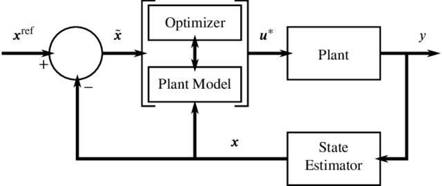

# NOTE: THIS IS A WORK IN PROGRESS!


# Introduction
The overall mission of this project is to implement advanced control techniques to make the *intelligent* home a reality that is accessible. 

## Control Systems
HAOS offers basic automations regarding turning switches on and off, or if the device supports it, tuning a specific variable (such as light intensity). These automations, although user friendly and fairly effective, have only the capabilities to implement condition-based control systems. To develop a true 'intelligent' home, the home needs to be able to automatically control actuators based on **goals** and **constraints** set by the user. The vision is to have the user input some relatively basic parameters (for example, keep temperature at 20°C) and some weighted optimisations (for example, minimise energy consumption (30%) and keep me comfortable (70%)). The controller then deals with _when_ to turn the heating on, and may use data such as energy price, current room temperature, external temperature etc. 

##### Example MPC Diagram


Image from [here](https://www.researchgate.net/publication/317881347_ICONE23-1934_A_FORMULATION_OF_ROD_BASED_NONLINEAR_MODEL_PREDICTIVE_CONTROL_OF_NUCLEAR_REACTION_WITH_TEMPERATURE_EFFECTS_AND_XENON_POISONING/figures?lo=1)

### System Identification / Physics Informed ML
To realise this, there are three key components of the system that need to function properly - the optimiser, the model and the state estimator (see [figure](#example-mpc-diagram)). All three rely on an accurate model of the system in question. To get the system model through data, system identification can be used, which requires adequate signal processing methods to minimise modelling errors. 

#### The PySINDy Library
PySINDy emphasises the use of _sparse_ regression, and seems the most appropriate System ID method to use so far. 


## Accessing Live Sensor Data through Websockets
In looking to develop my own custom automation systems that close the loop between sensors and actuators in HomeAssistant OS (HAOS), I saw the need to develop my own scripts that would enable me to access live HAOS sensor data in near-real-time. This prevents consistently querying the database to gather live sensor data, which in turn could reduce the sampling rate to below Nyquist frequency depending on the sensor. The [websocket](https://developers.home-assistant.io/docs/api/websocket/#validate-config) API available shows the `.json` format for communicating with HAOS, but there didn't seem to be anything for doing this using Python. 


# Finishing Line
This project will be finished when it:
- Can deployed as a container
- Can pull data from TimescaleDB that is set up on HAOS
- Can take user inputs for the optimisation
- Can perform live system identificaiotn
- Can perform adaptive control based on the system identificaiton
- Can adapt to sensor noise

<!-- # Intended Use
To be able to effectively interact with HAOS via Python scripts for advanced automation procedures. Although `.yaml` files can be used to create useful automations, it may be that more advanced automations should be developed, and for the processing to occur outside of HAOS. This set of scripts is intended to make the interplay between HAOS and some other techniques easier. -->

# Managing Credentials

Done via `python-dotenv`. Example file:
```
HASS_IO_AUTH_TOKEN = YOUR AUTH KEY
HASS_IO_HOSTNAME = ws://homeassistant.local:8123/api/websocket
YAML_NAME = subscriptions.yaml
```

# TODO:
- Sensor class
    - ~~Methods for cleaning data~~
    - ~~Methods to output numpy and pandas~~
    - Create virtual sensors for testing

- Actuator Class
    - Send commands to HAOS via the websocket/api.
    - Implement constraint attributes

- DatabaseManager class
    - ~~pull data from TimescaleDB~~
    - Get list of database components from TimescaleDB

- Signal Processing
    - ~~Implement simple filtering techinques~~
    - Implement more filtering techniques
    - Functions for optimising filters
    - Implement correlation functions
    - Manage multi-rate timeseries

- Real-time data
    - Use the websocket functionality of HAOS to allow the system to function live
    - Making the sensor class be able to collect real-time data via the websocket
